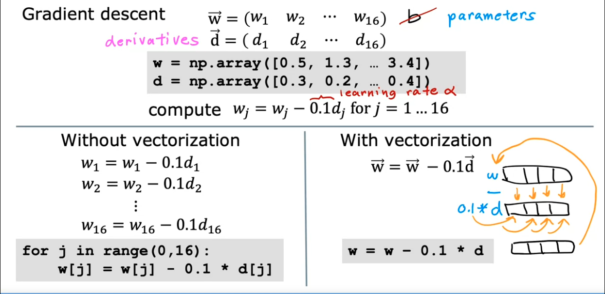

# TODO - import from notion

# 2. Supervised ML: Regression with Multiple Input Variables

## Multiple Linear Regression


### Multiple Features

TODO - implement

### Vectorization Part 1

when implementing learning algorithm, using vertorization will make your code faster, shorter, more efficient, you can use GPU hardware, etc.
params and features:

`w = [w1, w2, w3]`

`x = [x1, x2, x3]`

note that in linear algebra index starts at 1

in python we'll use numpy:

```
w = np.array([1.0, 2.5, -3.3])
b = 4
x = np.array([10, 20, 30])
```

f(x) = w1x1 + w2x2 + w3x3 + b
without vectorization, we will use a for look to sum wx, but we rather use vectorization

$
f_{w,b}(x) = \sum_{j=1}^{n} w_jx_j + b
$

in vectoirized notation:
$
f_{w,b}(x)=\vec w \cdot \vec x + b
$

and with numpy:

```
# apply the dot product to w and x
f = np.dot(w, x) + b
```

This is much faster than using a for loop and it's shorter (then using a for loop)


### Vectorization Part 2

Why is vectorization so much faster?

```
for j in range(0, 16):
    f += w[j] * x[j]
```

this runs one step at a time:

t0: f + w[0] * x[0]
t1: f + w[1] * x[1]
t2: f + w[2] * x[2]
...
t15: f + w[15] * x[15]


On the other hand, vectorization in numpy, gets all the values of w, x and in one step multiplies them.
then adds everything efficiently using hardware that can run in parallel (and GPU if possible)


`np.dot(w, x)`


this allow us to scale well with large datasets.

Here's how this helps us in gradient descent:




